## hi guys

I code in Java, Python, Lua, and whenever I find inspiration I try and learn other languages. I am absolutely obsessed with Minecraft, particularly in the modding side of things, and have wanted to make mods since I started playing Java Edition.
I hate semicolons.

---

---

[
[
